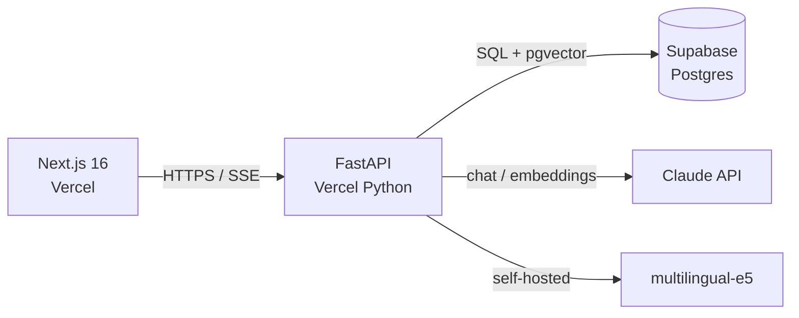

# Paper Companion

[](https://github.com/Aboubekrin999/paper-companion/actions/workflows/ci.yml)

> RAG-powered reading companion for academic papers. Ingest PDFs and arXiv links, ask questions, get answers with citations.

**Status:** The full path is wired, browser to streamed answer, but it runs in stub mode — no LLM key is configured, so answers come from a stub, and the default encoder is a 64-dim hash rather than multilingual-e5. In-memory index, not deployed. 255 tests green.

---

## The problem

Reading academic papers is the bottleneck of an AI master's degree. The flow today:

1. Find a paper → 2. Skim → 3. Decide if it's worth reading → 4. Read → 5. Take notes → 6. Forget half of it three weeks later.

Steps 2–3 waste hours per week. Steps 5–6 mean prior reading rarely compounds. Existing tools (ChatGPT, NotebookLM) help but don't keep state across papers, don't surface citations cleanly, and don't fit a research workflow.

## Who it's for

- Master's and PhD students in AI / ML / CS who read 5+ papers per week
- Researchers maintaining a personal library of relevant work
- Self-studiers working through a syllabus or textbook

Built first as a tool for my own reading, in English and French.

## What v1 does

**In scope:**
- Upload PDF or paste an arXiv link → paper is parsed, chunked, embedded, stored
- Ask questions about a single paper → grounded answer with citations to specific paragraphs
- Save notes per paper, persisted across sessions
- Bilingual: English and French (useful for [HAL](https://hal.science/) papers and FR-language coursework)

**Explicitly out for v1:**
- Multi-paper question answering (v2)
- Mobile (separate project — flashcard companion app, see [`docs/ROADMAP.md`](docs/ROADMAP.md))
- Sharing / collaboration (later)
- Auto-summarization at ingest (see [ADR-005](docs/DECISIONS.md#adr-005))

## What's built today

Honest state of the repo, so you can tell the code from the plan.

| Area | State |
|---|---|
| **Ingest** — arXiv fetcher, PDF parser, recursive chunker, end-to-end pipeline | Built, tested |
| **Retrieval** — encoder protocol, in-memory brute-force cosine index | Built, tested |
| **Embedding model** — `E5Encoder` (local), `HFInferenceEncoder` (deployed), `HashEncoder` (tests) | Built, tested — selected by `EMBEDDING_BACKEND`, see [ADR-007](docs/DECISIONS.md#adr-007) |
| **Chat** — orchestrator, Claude streaming wrapper with prompt caching | Built, tested |
| **Eval harness** — items, metrics, runner for retrieval quality | Built, tested |
| **HTTP API** — `/health`, ingest, `/papers`, `/papers/{id}`, `/papers/{id}/chat` (SSE) | Built, tested |
| **API auth** — Supabase JWT verification, every data route scoped to its caller | Built, tested |
| **Web auth** — Supabase magic link, protected routes, library shell | Built |
| **Web chat UI** — streams the answer, paints citation chips before the first token | Built — typechecks and builds; not yet exercised against a running API |
| **Web library** — list papers, ingest an arXiv link, open a paper | Built — same caveat |
| **A real grounded answer** — needs `ANTHROPIC_API_KEY` and `EMBEDDING_BACKEND=e5` | Not yet run |
| **pgvector persistence** — currently in-memory; Supabase-backed index | Not built |

255 tests pass (`pytest`), 1 skipped. CI typechecks `web/` and runs the `api/` suite on every PR.

Work paused in May 2026 while client delivery took priority. Nothing above is aspirational — the roadmap in [`docs/ROADMAP.md`](docs/ROADMAP.md) covers what comes next.

## Tech stack

| Layer | Choice | Rationale |
|---|---|---|
| Frontend | Next.js 16 (App Router) + TypeScript | Server components for streaming RAG responses; one-click Vercel deploy |
| Backend | Python + FastAPI | RAG ecosystem is Python-first; clean OpenAPI for the future mobile client |
| Database | Supabase (Postgres + pgvector + Auth) | One service for relational data, vector search, and auth |
| LLM | Anthropic Claude (Sonnet for chat, Haiku for pre-processing) | Long-context reading and honest citation behavior |
| Embeddings | `intfloat/multilingual-e5-large` — local weights in dev, hosted inference when deployed | Open, strong on FR + EN; same 1024-d vectors either way ([ADR-007](docs/DECISIONS.md#adr-007)) |
| Hosting | Vercel (web + Python Functions) · Supabase (data) | One platform for both layers (see [ADR-006](docs/DECISIONS.md#adr-006)); generous free tiers |

Full reasoning in [`docs/DECISIONS.md`](docs/DECISIONS.md).

## Architecture



## Roadmap

Four-week shipping plan in [`docs/ROADMAP.md`](docs/ROADMAP.md). Weekly milestones, each ending with a working demo.

## Local development

### API (FastAPI)

```bash
cd api
python3 -m venv .venv && source .venv/bin/activate
pip install -r requirements.txt
cp .env.example .env          # fill in Supabase + Anthropic keys

pytest                        # 255 passed, 1 skipped
uvicorn api.index:app --reload --port 8000
```

Swagger UI at <http://localhost:8000/docs>. The test suite needs no keys or network — it runs against fixtures, so `pytest` works on a fresh clone.

### Web (Next.js)

```bash
cd web
npm ci
cp .env.example .env.local    # NEXT_PUBLIC_SUPABASE_URL + anon key
npm run dev
```

App at <http://localhost:3000>. A Supabase URL and anon key are required for any route — the auth middleware runs on every request, so without them the server returns 500 rather than rendering a signed-out shell. Creating a free Supabase project and pasting the two values is enough; no schema setup is needed to see the library view.

## Author

**Aboubekrin Mohamed Salem** — software engineer, Paris.

I built this to work through retrieval-augmented generation end to end rather than from a tutorial: chunking strategy, embedding choice, how to evaluate retrieval honestly, and streaming a grounded answer back to a reader. The reasoning behind each choice — including the ones I would revisit — is in [`docs/DECISIONS.md`](docs/DECISIONS.md).

GitHub: [@Aboubekrin999](https://github.com/Aboubekrin999)
