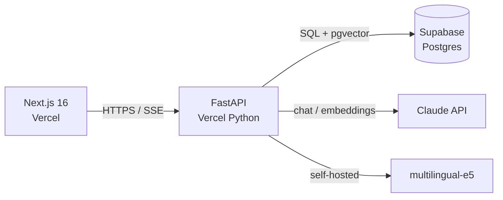

# Paper Companion

> RAG-powered reading companion for academic papers. Ingest PDFs and arXiv links, ask questions, get answers with citations.

**Status:** In development — v1 target end of May 2026

---

## The problem

Reading academic papers is the bottleneck of an AI master's degree. The flow today:

1. Find a paper → 2. Skim → 3. Decide if it's worth reading → 4. Read → 5. Take notes → 6. Forget half of it three weeks later.

Steps 2–3 waste hours per week. Steps 5–6 mean prior reading rarely compounds. Existing tools (ChatGPT, NotebookLM) help but don't keep state across papers, don't surface citations cleanly, and don't fit a research workflow.

## Who it's for

- Master's and PhD students in AI / ML / CS who read 5+ papers per week
- Researchers maintaining a personal library of relevant work
- Self-studiers working through a syllabus or textbook

Built first for the author's own use as an AI master's student, working in English and French.

## What v1 does

**In scope:**
- Upload PDF or paste an arXiv link → paper is parsed, chunked, embedded, stored
- Ask questions about a single paper → grounded answer with citations to specific paragraphs
- Save notes per paper, persisted across sessions
- Bilingual: English and French (useful for [HAL](https://hal.science/) papers and FR-language coursework)

**Explicitly out for v1:**
- Multi-paper question answering (v2)
- Mobile (separate project — flashcard companion app, see [`docs/ROADMAP.md`](docs/ROADMAP.md))
- Sharing / collaboration (later)
- Auto-summarization at ingest (see [ADR-005](docs/DECISIONS.md#adr-005))

## Tech stack

| Layer | Choice | Rationale |
|---|---|---|
| Frontend | Next.js 16 (App Router) + TypeScript | Server components for streaming RAG responses; one-click Vercel deploy |
| Backend | Python + FastAPI | RAG ecosystem is Python-first; clean OpenAPI for the future mobile client |
| Database | Supabase (Postgres + pgvector + Auth) | One service for relational data, vector search, and auth |
| LLM | Anthropic Claude (Sonnet for chat, Haiku for pre-processing) | Long-context reading and honest citation behavior |
| Embeddings | `intfloat/multilingual-e5-large` | Open, strong on FR + EN, no per-call cost |
| Hosting | Vercel (web + Python Functions) · Supabase (data) | One platform for both layers (see [ADR-006](docs/DECISIONS.md#adr-006)); generous free tiers |

Full reasoning in [`docs/DECISIONS.md`](docs/DECISIONS.md).

## Architecture

## Roadmap

Four-week shipping plan in [`docs/ROADMAP.md`](docs/ROADMAP.md). Weekly milestones, each ending with a working demo.

## Local development

> Documented as each layer lands. `web/` quickstart after week 1, `api/` quickstart after week 2, full local-first stack after week 3.

## Author

**Aboubekrin Mohamed Salem** — AI Master's student. Building this as a portfolio piece and a daily-use tool. Open to feedback and to hiring conversations.

GitHub: [@Aboubekrin999](https://github.com/Aboubekrin999)
